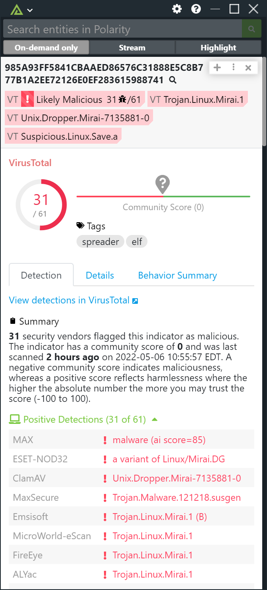
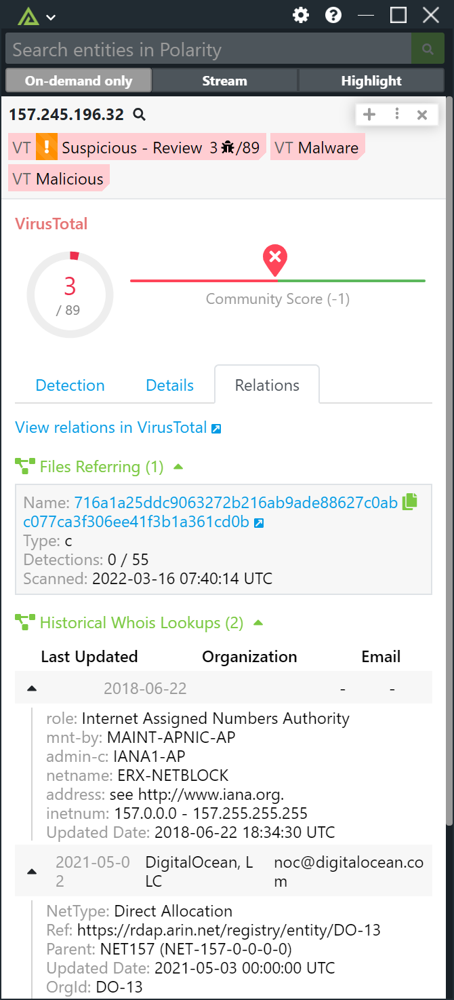

# Polarity VirusTotal Integration

Polarity's VirusTotal integration gives users access to automated MD5, SHA1, SHA256, IPv4, Domain, and URL lookups within VirusTotal and makes use of the v3.0 REST API.

VirusTotal is a service that analyzes suspicious files and URLs and facilitates the quick detection of viruses, worms, trojans, and all kinds of malware.  For more information about VirusTotal please visit https://www.virustotal.com/.

  
  

  

## VirusTotal Integration Options

### VirusTotal API Key

Your VirusTotal Premium API Key

### Show "No Information in VirusTotal"

Default: false

If checked, this option will make it so when there are no results in Virus Total it will always display the tag summary "No Information in VirusTotal".

### Show All File Scanner AV Results

Default: true

If checked, the integration will show all AV scanner results for files (hashes) even if the AV scanner did not detect the sample as a positive detection. Default is to show all results. Uncheck to only show positive AV detections in the scanner results table.

### Show Files (Hashes) with No Detections

Default: false

If checked, the integration will show results for files that have no positive detections.

### Show IP Addresses with No Detections

Default: false

If checked, the integration will show results for IP addresses that have no positive detections. By default, the integration will not show IP reports with no positive detections even if the IP address in question has a resolved hostname.

### Show Domains with No Detections

Default: false

If checked, the integration will show results for Domains that have no positive detections.

### Show Urls with No Detections

Default: false

If checked, the integration will show results for Urls that have no positive detections.

### API Key Lookup Limit Reached Warning Message

Default: false

Displays a warning in the Notification Window if you have reached your VirusTotal API key lookup limit.

### Lookup Throttle Duration

Default: 1 minute

The amount of time in minutes the integration will throttle your VirusTotal lookups in the event that you hit your lookup limit. Once throttling has started no lookups for your configured API key will be made until the throttle time has passed. Defaults to 1 minute.

### Lookup Throttle Warning Message

Default: true

If checked, the integration will display a warning message in the overlay window when your VirusTotal lookups are being throttled.  Only one message will be shown per throttle duration.

## Installation Instructions

Installation instructions for integrations are provided on the [PolarityIO GitHub Page](https://polarityio.github.io/).

## Polarity

Polarity is a memory-augmentation platform that improves and accelerates analyst decision making.  For more information about the Polarity platform please see:

https://polarity.io/
